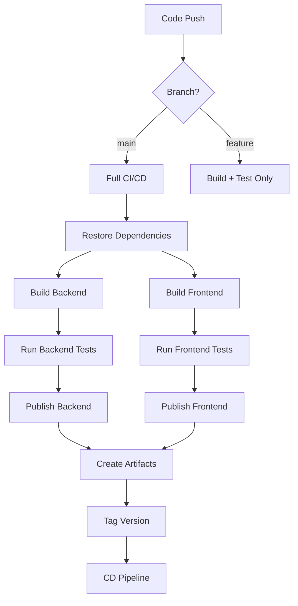
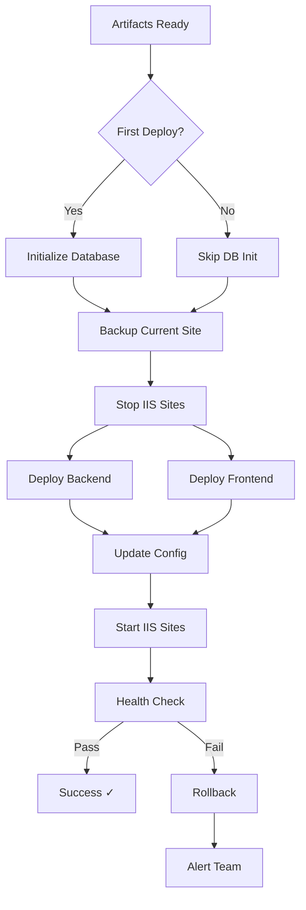

# CateringEcommerce CI/CD Pipeline
## Complete DevOps Setup for IIS Deployment

**Last Updated**: February 6, 2026
**Target Platform**: Windows Server + IIS
**CI/CD Tool**: Azure DevOps (adaptable to GitHub Actions)

---

## 📋 Table of Contents
1. [Architecture Overview](#architecture-overview)
2. [Folder Structure](#folder-structure)
3. [Pipeline Flow](#pipeline-flow)
4. [First-Time Setup](#first-time-setup)
5. [Redeployment Flow](#redeployment-flow)
6. [Rollback Strategy](#rollback-strategy)
7. [Troubleshooting](#troubleshooting)

---

## 🏗️ Architecture Overview

```
┌─────────────────────────────────────────────────────────────┐
│                     CI/CD PIPELINE FLOW                      │
├─────────────────────────────────────────────────────────────┤
│                                                               │
│  ┌──────────────┐    ┌──────────────┐    ┌──────────────┐  │
│  │   Code Push  │───▶│  CI Pipeline │───▶│ CD Pipeline  │  │
│  │  (Git Repo)  │    │   (Build)    │    │   (Deploy)   │  │
│  └──────────────┘    └──────────────┘    └──────────────┘  │
│                            │                      │          │
│                            ▼                      ▼          │
│                     ┌──────────────┐      ┌──────────────┐  │
│                     │   Artifacts  │      │ IIS Server   │  │
│                     │  (Versioned) │      │  Production  │  │
│                     └──────────────┘      └──────────────┘  │
│                                                   │          │
│                                                   ▼          │
│                                            ┌──────────────┐  │
│                                            │  SQL Server  │  │
│                                            │  (One-time)  │  │
│                                            └──────────────┘  │
└─────────────────────────────────────────────────────────────┘
```

---

## 📁 Folder Structure

```
CateringEcommerce/
│
├── CI-CD/                              # CI/CD Pipeline Definitions
│   ├── README.md                       # This file
│   ├── pipeline.yml                    # Main pipeline orchestrator
│   ├── variables.yml                   # Environment variables
│   ├── build-backend.yml               # Backend build steps
│   ├── build-frontend.yml              # Frontend build steps
│   ├── deploy-backend.yml              # Backend deployment stage
│   ├── deploy-frontend.yml             # Frontend deployment stage
│   └── test.yml                        # Test execution stage
│
├── Deploy/                             # Deployment Scripts
│   ├── deploy-backend-iis.ps1          # Backend IIS deployment
│   ├── deploy-frontend-iis.ps1         # Frontend IIS deployment
│   ├── db-init.ps1                     # One-time DB initialization
│   ├── db-check.ps1                    # DB initialization checker
│   ├── backup-site.ps1                 # Backup before deployment
│   ├── rollback.ps1                    # Rollback to previous version
│   ├── health-check.ps1                # Post-deployment validation
│   └── config/
│       ├── appsettings.Production.json # Production app settings
│       └── web.config                  # IIS configuration
│
├── CateringEcommerce.API/              # Backend API
├── CateringEcommerce.Web/Frontend/     # React Frontend
└── Database/                           # DB initialization scripts
```

---

## 🔄 Pipeline Flow

### **CI Pipeline (Continuous Integration)**



**CI Stages**:
1. **Checkout** - Get source code
2. **Restore** - NuGet + npm dependencies
3. **Build** - Backend (Release) + Frontend (production)
4. **Test** - Unit tests + integration tests
5. **Publish** - Create deployment artifacts
6. **Artifact Upload** - Version and store builds

### **CD Pipeline (Continuous Deployment)**



**CD Stages**:
1. **Pre-Deployment**
   - Check DB initialization status
   - Backup current deployment
   - Validate artifacts

2. **Database Migration**
   - Run ONLY on first deployment
   - Check version table
   - Execute SQL scripts
   - Mark as initialized

3. **Deployment**
   - Stop IIS application pools
   - Deploy backend to IIS
   - Deploy frontend to IIS
   - Update configurations

4. **Post-Deployment**
   - Start IIS application pools
   - Health check endpoints
   - Smoke tests
   - Rollback if failed

---

## 🎬 First-Time Setup

### Prerequisites
- Windows Server 2019/2022
- IIS 10+ installed
- .NET 9.0 Runtime
- SQL Server 2019+
- Git installed on build agent

### Step 1: Configure Build Agent
```powershell
# Install required software
choco install dotnet-9.0-sdk -y
choco install nodejs-lts -y
choco install sql-server-management-studio -y

# Verify installations
dotnet --version
node --version
npm --version
```

### Step 2: Configure IIS
```powershell
# Run as Administrator
cd D:\Pankaj\Project\CateringEcommerce\Deploy

# Create IIS sites and app pools (automated)
.\setup-iis.ps1 -Environment Production
```

This creates:
- **App Pool**: CateringEcommerce_API_Pool (.NET CLR v4.0, Integrated)
- **App Pool**: CateringEcommerce_Web_Pool (No Managed Code)
- **Site**: CateringEcommerce_API (Port 5000)
- **Site**: CateringEcommerce_Web (Port 80/443)

### Step 3: Configure Database
```powershell
# Initialize database (ONE-TIME ONLY)
.\db-init.ps1 `
    -ServerName "localhost\SQLEXPRESS" `
    -DatabaseName "CateringEcommerceDB" `
    -ScriptsPath "..\Database" `
    -Force
```

### Step 4: Configure Pipeline Variables
Edit `CI-CD/variables.yml`:
```yaml
variables:
  # IIS Configuration
  IIS_SERVER: 'production-server.domain.com'
  IIS_API_SITE: 'CateringEcommerce_API'
  IIS_WEB_SITE: 'CateringEcommerce_Web'
  IIS_API_PATH: 'C:\inetpub\wwwroot\CateringAPI'
  IIS_WEB_PATH: 'C:\inetpub\wwwroot\CateringWeb'

  # Database Configuration
  DB_SERVER: 'localhost\SQLEXPRESS'
  DB_NAME: 'CateringEcommerceDB'
  DB_INIT_FLAG_TABLE: 'DeploymentHistory'

  # Build Configuration
  BUILD_CONFIGURATION: 'Release'
  DOTNET_VERSION: '9.0.x'
  NODE_VERSION: '20.x'

  # Versioning
  VERSION_PREFIX: '1.0'
  VERSION_SUFFIX: '$(Build.BuildNumber)'
```

### Step 5: Set Pipeline Secrets
In Azure DevOps → Pipelines → Library → Add Variable Group:

**Variable Group**: `CateringEcommerce-Production`
- `DB_CONNECTION_STRING` (Secret) - SQL connection string
- `JWT_SECRET_KEY` (Secret) - JWT signing key
- `EMAIL_API_KEY` (Secret) - SendGrid API key
- `SMS_API_KEY` (Secret) - Twilio API key
- `ENCRYPTION_KEY` (Secret) - Data encryption key

### Step 6: Run First Deployment
```bash
# Trigger pipeline manually or via commit
git commit -m "Initial production deployment"
git push origin main
```

**First deployment will**:
1. ✅ Build backend + frontend
2. ✅ Run all tests
3. ✅ Initialize database (creates tables, sprocs, seed data)
4. ✅ Deploy to IIS
5. ✅ Run health checks

---

## 🔁 Redeployment Flow

### Automated Redeployment (on every push to `main`)

```powershell
# Automatic on Git push
git commit -m "feat: Add new feature"
git push origin main
# Pipeline automatically triggers
```

**Redeployment will**:
1. ✅ Build new version
2. ✅ Run tests
3. ⏭️ **SKIP database initialization** (already done)
4. ✅ Backup current deployment
5. ✅ Deploy new version
6. ✅ Health check
7. ✅ Rollback if failed

### Manual Redeployment

```powershell
# From Azure DevOps UI
# Pipelines → CateringEcommerce → Run Pipeline
# Select branch: main
# Click Run
```

---

## ⏮️ Rollback Strategy

### Automatic Rollback (on failed health check)

Pipeline automatically rolls back if:
- Health check endpoint returns non-200 status
- Application pool fails to start
- Critical errors in event log

### Manual Rollback

```powershell
# SSH/RDP to production server
cd C:\Deployments\CateringEcommerce\Deploy

# List available backups
.\list-backups.ps1

# Rollback to specific version
.\rollback.ps1 -Version "1.0.45" -Confirm

# Rollback to previous version (automatic)
.\rollback.ps1 -Previous -Confirm
```

**Rollback Process**:
1. Stop IIS sites
2. Restore files from backup
3. Restore web.config
4. Start IIS sites
5. Verify health check
6. Alert DevOps team

### Rollback Database (DANGEROUS - Manual Only)

⚠️ **Database rollback NOT automated** - requires manual SQL restore

```sql
-- Restore from backup (manual process)
USE master;
GO
RESTORE DATABASE CateringEcommerceDB
FROM DISK = 'C:\Backups\CateringEcommerceDB_2026-02-06.bak'
WITH REPLACE, RECOVERY;
GO
```

---

## 🔍 Health Checks

### Automated Health Checks

Pipeline performs these checks after deployment:

```powershell
# Backend API health
Invoke-WebRequest -Uri "https://api.enyvora.com/health" -UseBasicParsing

# Frontend availability
Invoke-WebRequest -Uri "https://enyvora.com" -UseBasicParsing

# Database connectivity
Invoke-Sqlcmd -Query "SELECT 1" -ServerInstance $DbServer
```

### Manual Health Verification

```powershell
# Run comprehensive health check
cd D:\Pankaj\Project\CateringEcommerce\Deploy
.\health-check.ps1 -Verbose

# Check application logs
.\view-logs.ps1 -Lines 50
```

---

## 🐛 Troubleshooting

### Common Issues

#### **Issue**: Database initialization fails
```powershell
# Check if DB already initialized
.\db-check.ps1 -ServerName "localhost\SQLEXPRESS" -DatabaseName "CateringEcommerceDB"

# Force reinitialize (DANGEROUS - drops all data)
.\db-init.ps1 -Force -Confirm
```

#### **Issue**: IIS site won't start
```powershell
# Check app pool status
Get-IISAppPool | Where-Object {$_.Name -like "*Catering*"}

# Check event logs
Get-EventLog -LogName Application -Source "IIS*" -Newest 20 | Format-Table -AutoSize

# Restart app pools manually
Restart-WebAppPool -Name "CateringEcommerce_API_Pool"
Restart-WebAppPool -Name "CateringEcommerce_Web_Pool"
```

#### **Issue**: Build fails
```powershell
# Clear NuGet cache
dotnet nuget locals all --clear

# Clear npm cache
npm cache clean --force

# Retry build
dotnet build --no-incremental
```

#### **Issue**: Deployment hangs
```powershell
# Kill stuck IIS worker processes
Get-Process w3wp | Stop-Process -Force

# Restart IIS
iisreset /restart
```

---

## 📊 Monitoring & Alerts

### Application Insights (Optional)
```xml
<!-- Add to appsettings.Production.json -->
{
  "ApplicationInsights": {
    "InstrumentationKey": "your-key-here",
    "EnableAdaptiveSampling": true
  }
}
```

### Email Alerts
Pipeline sends email on:
- ✅ Successful deployment
- ❌ Failed deployment
- ⚠️ Health check failures
- 🔄 Rollback events

---

## 🔐 Security Checklist

Before going to production:

- [ ] All secrets in Azure Key Vault or Variable Groups
- [ ] No hardcoded connection strings
- [ ] HTTPS enforced on IIS
- [ ] SQL Server uses Windows Authentication
- [ ] IIS app pool runs under least-privilege account
- [ ] File system permissions restricted
- [ ] Web.config transforms applied correctly
- [ ] CORS configured for production domain only
- [ ] Rate limiting enabled
- [ ] Security headers configured

---

## 📞 Support

**DevOps Team**: devops@enyvora.com
**On-Call**: +91-XXXX-XXXXXX
**Runbook**: Confluence → DevOps → CateringEcommerce
**Incident Management**: Jira Service Desk

---

## 📝 Version History

| Version | Date | Changes | Deployed By |
|---------|------|---------|-------------|
| 1.0.0 | 2026-02-06 | Initial production release | DevOps Team |
| 1.0.1 | 2026-02-07 | Security fixes applied | Auto (CI/CD) |

---

**Document Version**: 1.0
**Last Review**: February 6, 2026
**Next Review**: March 6, 2026
